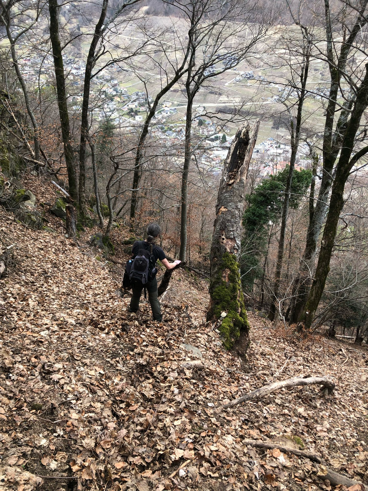
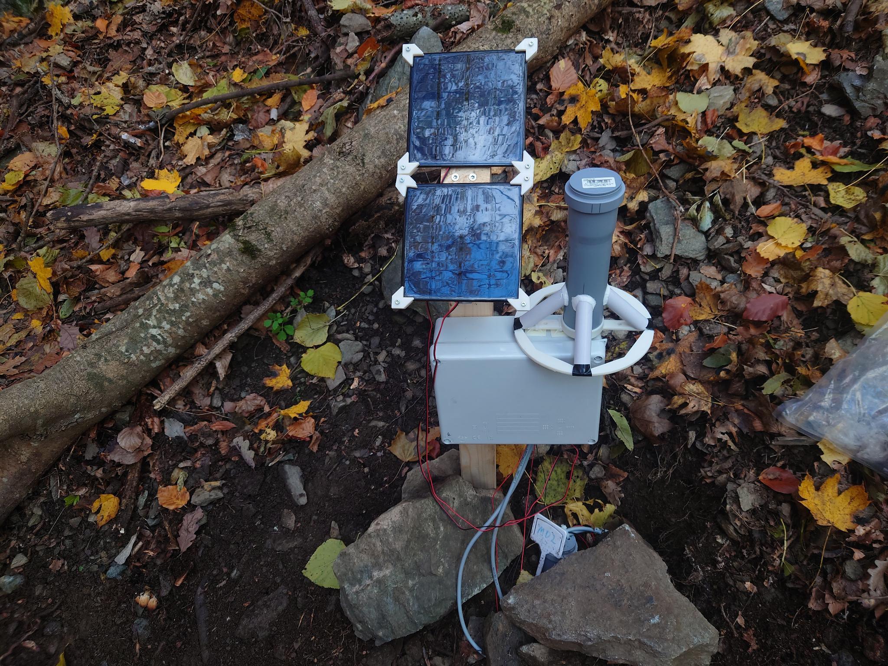
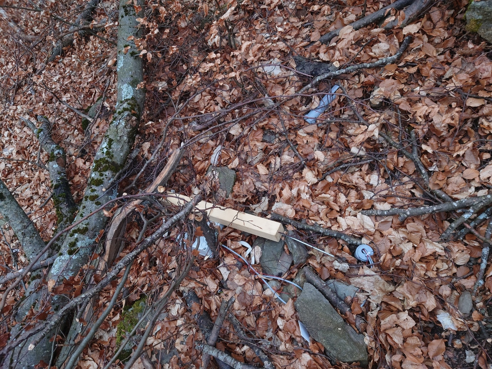
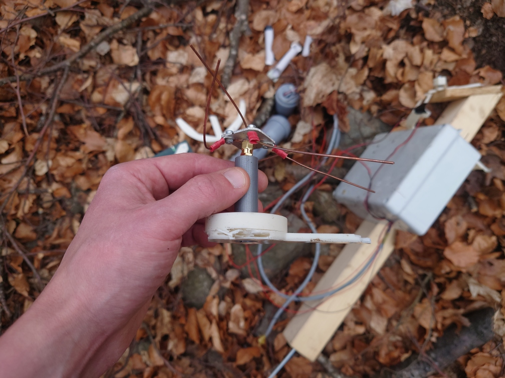
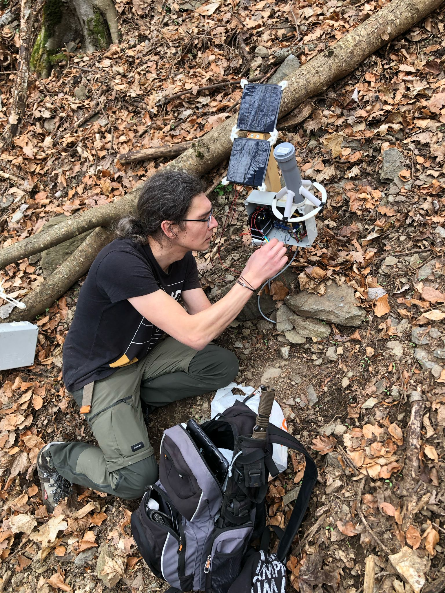

# Impressions of our sensor installation close to Martigny

##### Fig. 1: A most welcoming terrain to roam around and deploy seonsors. The protective forest takes its job very seriously and also protects from a wonderful view of Martigny. 

##### Fig. 2: A happy sensor node doing its work after installation. 

##### Fig. 3: A less happy sensor node after eating branch that fell off the tree next to it.

##### Fig. 4: An antenna is also unahppy about a close meeting with a tree branch. 

##### Fig. 5: A forest on a slope is probably one of the weirder workbenches for electronics projects, but a surpisingly fun one, too!  

[back](./)
