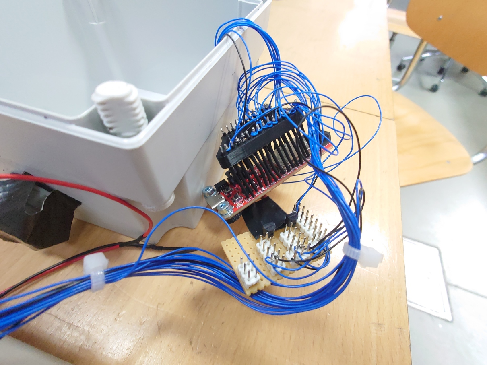
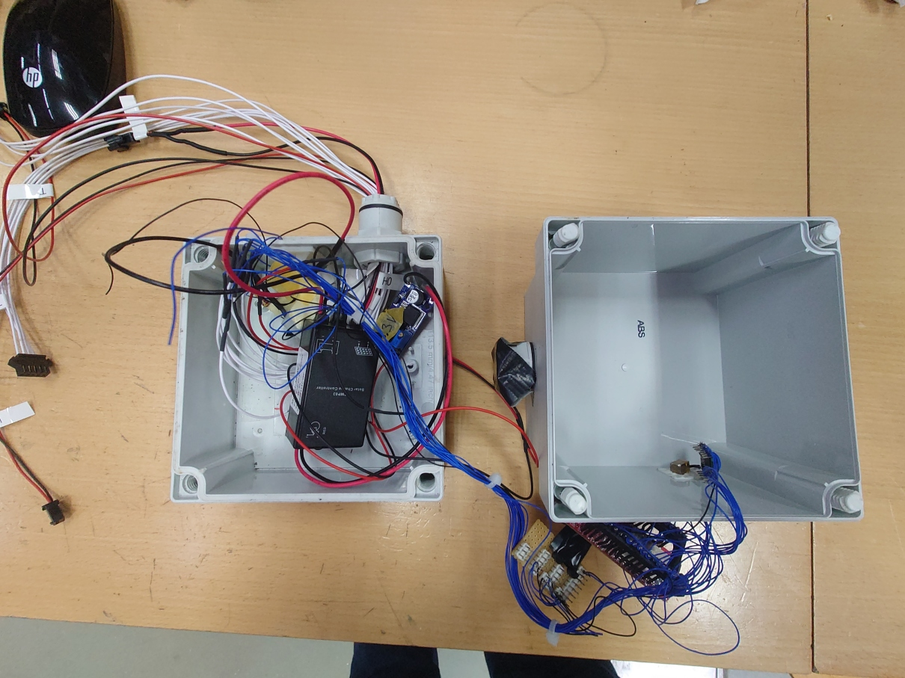
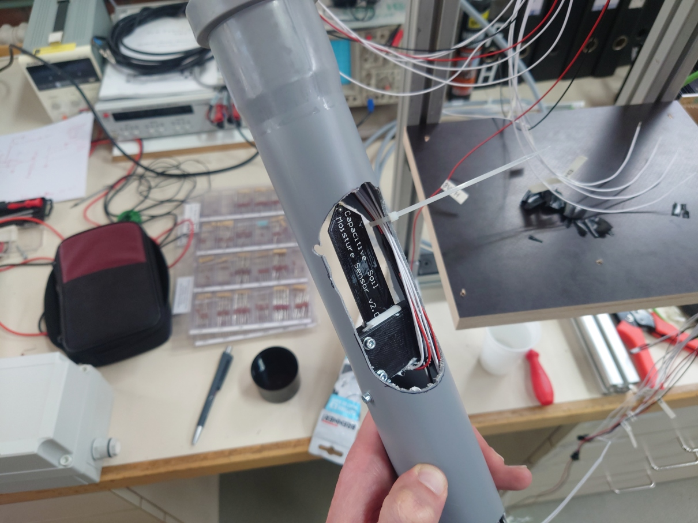
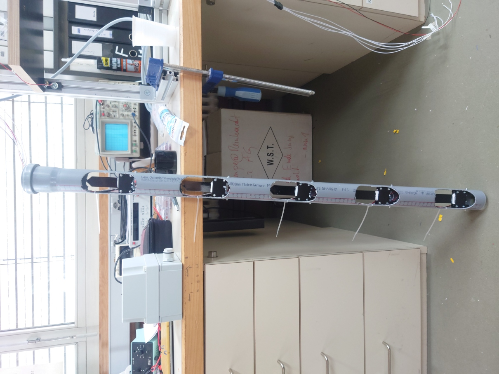
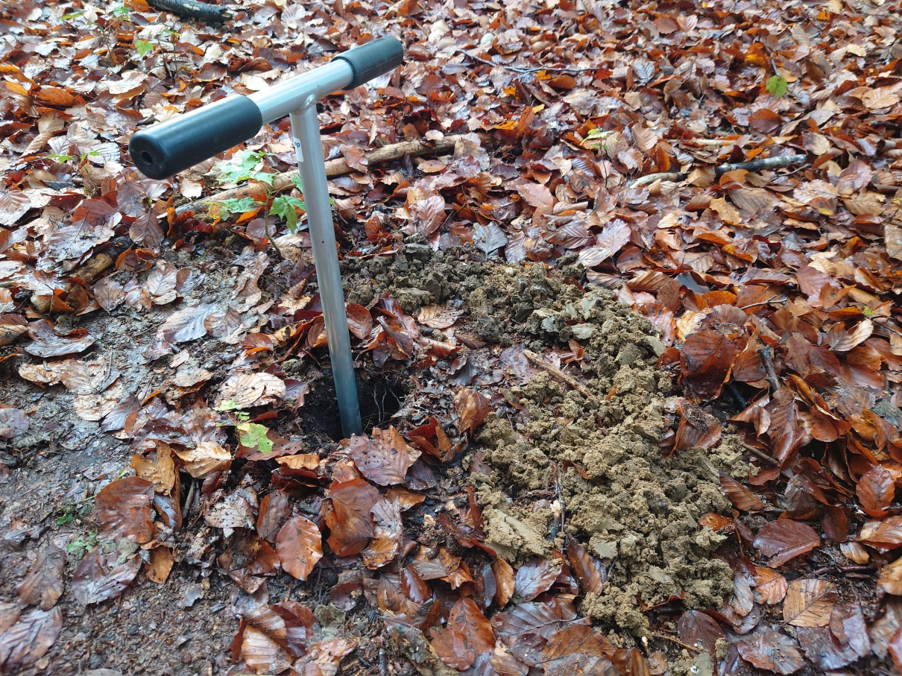
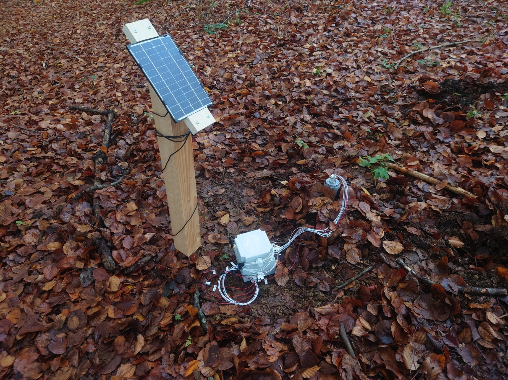

# Sensor prototype

We deployed a (working) prototype of our sensor node in autumn of 2022. This page shows some images so you can get an impression of the result of project looks like physically.

## Electronics

It can be clearly seen that the wiring was done by a professional.

## Mechanical Design

We fix the sensorheads themselves with 3d printed holders in a 50 mm PVC sewage pipe. This provides the entire setup with some rigity, holds the sensors in place and allows us to easily remove everything from the soil as soon as a node reaches end of life or needs maintenance. Note that all contacts are sealed with silicone. In addition, we applied conformal coating to PCBs that are in direct contact with soil.

## Deployment

The slim design of our sensor allows it to be deployed relatively easily into a hole drilled with a manual earth auger. This yields enough loose soil for it to be packed around the moisture sensors to ensure good contact with the underground environment. Eventually, we intend to install more sensor nodes in protection forests which are typically on slopes with very rocky soils. Thus it is beneficial, if as little heavy gear as possible is required for the installation.

[back](./)
