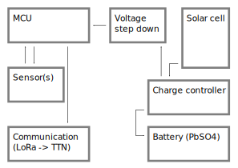

# Overview of the system architecture

Here, we provide a quick overview of our project's system architecture. The aim has always been to use widely available off the shelf components.

## Data transfer

Data from each sensor node is being transferred using the [LoRa](https://en.wikipedia.org/wiki/LoRa) protocol (see Fig. 1). [The Things Network (TTN)](https://www.thethingsnetwork.org/) usually serves as the backhaul to make readings available over the internet. Unfortunately, no TTN gateway was anywhere close to our test site in Martigny, thus we had to switch to a commercial LoRa backhaul provided by a local telecom company. An MQTT client on our own servers then collects the data and stores it in and [InfluxDB](https://www.influxdata.com/) instance. For pretty dashboards, we use [Grafana](https://grafana.com/). 

##### Fig. 1: Overview of our communication stack

While we chose to host the database and visualization on our own infrastructure, this architecture can also be entirely deployed on existing services online. Of course, almost any other database can be used for storage and it's up to you if you want live visualization. Our experience has shown that live visualization can be extremely valuable for monitoring the sensors themselves.

More recently it has proven to be more convenient to make a small custom API that accepts webhook requests from the backhaul servers pushing the data onto our systems.  

## Sensor node

We currently use cheap capacitive moisture sensors for our measurements. Their precision is everything but great, but calibration helps a lot here. Watch this space to see how we automated this process with one of our robots. Simulateneously, we also measure the temperature around each sensor with a TMP36 probe. 

The entire node is powered with a solar cell and a lead acid battery. While this battery technology is outdated, we chose it due to its durability against high and low temperatures as well as other types of abuse. We can expect our nodes to need charging at sub zero temperatures. And on the high temperature end, we really wouldn't want to deploy highly flammable LiPo batteries into a forest during a period of fire hazard ;)

Initially the brains of the operation was a devkit based around an ESP32. We currently use [Sparkfun's Thing Plus based around the ESP32-S2](https://www.sparkfun.com/products/17743). This board not only performed rather poorly during deep sleep in terms of its power consumption, it also quickly became clear that the onboard A/D converter is extremely noisy and has an annoying temperature dependence. 

So the ESP32-based solution was ditched for [Cube Cell AB01](https://heltec.org/project/htcc-ab01-v2/) boards by Heltec Automation. These boards come with an integrated LoRa modem and allow to interface peripherals through a number of common protocols. We chose the ubiquitous [ADS1115](https://www.ti.com/product/ADS1115) to turn our voltage signals into bits. It is noteworthy that when checking the antennas supplied with our devkits, most of them seemed to be tuned to the 915 MHz band (US). We ended up making our own [quarter wave ground plane antennas](https://m0ukd.com/calculators/quarter-wave-ground-plane-antenna-calculator/) for the correct frequency range for Europe (868 MHz).  

An abstract overview of the sensor node design is provided in Fig. 2.

##### Fig. 2: Overview of the sensor node

Most of the components in this design can be (and some already were) exchanged for something different, should sourcing become difficult and/or new hardware be released. 

[back](./)
