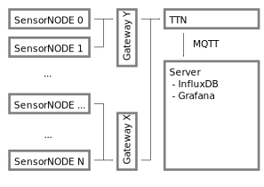

# Overview of the system architecture

Here, we provide a quick overview of our project's system architecture. As we are currently in the process of revising the hardware design of the sensor nodes to use dedicated A/D converters, the source code for programming the MCU is not yet available. As soon as the revision is finished, a link to the source code will be provided.

We use widely available off the shelf components.

## Data transfer

Data from each sensor node is being transferred using the [LoRa](https://en.wikipedia.org/wiki/LoRa) protocol (see Fig. 1). [The Things Network (TTN)](https://www.thethingsnetwork.org/) serves as the backhaul to make readings available over the internet. An MQTT client on our own servers then collects the data and stores it in and [InfluxDB](https://www.influxdata.com/) instance. For pretty dashboards, we use [Grafana](https://grafana.com/).

##### Fig. 1: Overview of our communication stack

While we chose to host the database and visualization on our own infrastructure, this architecture can also be entirely deployed on existing services online. Of course, almost any other database can be used for storage and it's up to you if you want live visualization. Our experience has shown that live visualization can be extremely valuable for monitoring the sensors themselves.

## Sensor node

We currently use cheap capacitive moisture sensors for our measurements. Their precision is everything but great, but we are optimistic that we can compensate for most inaccuracies with proper calibration. Simulateneously, we also measure the temperature around each sensor with a TMP36 probe.

The entire node is powered with a solar cell and a lead acid battery. While this battery technology is admittedly outdated, we chose it due to its durability against high and low temperatures as well as other types of abuse. We can expect our nodes to need charging at sub zero temperatures. And on the high temperature end, we really wouldn't want to deploy highly flammable LiPo batteries into a forest during a period of fire hazard ;)

The brains of the operation is a devkit based around an ESP32. We currently use [Sparkfun's Thing Plus based around the ESP32-S2](https://www.sparkfun.com/products/17743). If you chose your own MCU board, make sure that its periphery is optimized for low power consumption during deep sleep.

The LoRa communication itself is managed by a board build around the SX127x series of chips.

The sensor prototype showed rather impressively the poor performance of A/D converters integrated directly into MCUs. Therefore, we are currently evaluating alternatives that will allow us using dedicated A/D converters with digital communication and integrate LoRa communication.

An abstract overview of the sensor node design is provided in Fig. 2.

##### Fig. 2: Overview of the sensor node

Most of the components in this design can be exchanged for something different, should sourcing become difficult and/or new hardware be released

[back](./)
